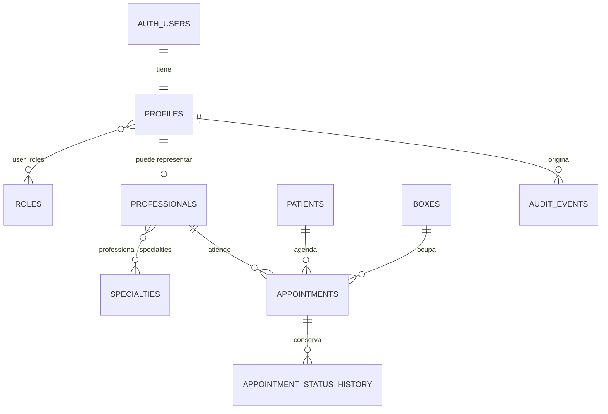

# Modelo de datos y RLS — fase 2 aplicada en desarrollo

Estado: **migrado al proyecto Supabase de desarrollo el 16 de agosto de 2026**.
Este documento no autoriza datos reales ni producción. El detalle ejecutable
está en `supabase/migrations/20260816053346_phase_2_auth_rls.sql`.

## Límites de la primera aprobación

La primera migración debería cubrir solo la base de acceso y operación inicial: perfiles, roles, profesionales, boxes, pacientes administrativos, citas y auditoría. Los datos clínicos, odontograma, armonización, documentos, finanzas e inventario requieren incrementos separados.

## Entidades iniciales

| Entidad | Campos principales | Integridad |
|---|---|---|
| `profiles` | `id` UUID → `auth.users`, nombre, estado | El usuario no cambia su rol mediante metadata editable. |
| `roles` | código, nombre, ámbito | Códigos explícitos y únicos. |
| `user_roles` | usuario, rol, vigencia | Sin elevación por cliente; cambios auditados. |
| `professionals` | perfil, registro interno, estado | Desactivación conserva historial. |
| `specialties` | código, nombre, área | Catálogo controlado. |
| `boxes` | nombre, ubicación, estado | No borrar si existe agenda histórica. |
| `patients` | UUID, identificador normalizado, contacto, estado | Duplicados se advierten; no se fusionan automáticamente. |
| `appointments` | paciente, profesional, box, inicio/fin, estado | Exclusión transaccional de conflicto por profesional y box. |
| `appointment_status_history` | cita, estado anterior/nuevo, actor, motivo | Append-only. |
| `audit_events` | actor, acción, entidad, registro, resultado, fecha | Append-only; sin secretos ni contenido clínico innecesario. |

## Estados iniciales

- Paciente: `active`, `inactive`, `follow_up`, `archived`.
- Cita: `reserved`, `pending_confirmation`, `confirmed`, `waiting`, `in_progress`, `completed`, `cancelled`, `no_show`.
- Profesional y box: `active`, `inactive`.

## Matriz RLS preliminar

| Recurso/acción | Admin | Recepción | Odontólogo | Armonización | Finanzas | Inventario | Auditor |
|---|---:|---:|---:|---:|---:|---:|---:|
| Perfil propio: ver | Sí | Sí | Sí | Sí | Sí | Sí | Sí |
| Roles: administrar | Sí | No | No | No | No | No | Solo lectura |
| Paciente administrativo: ver | Sí | Sí | Asignados | Asignados | Mínimo para cobro | No | Solo lectura autorizada |
| Paciente administrativo: editar | Sí | Sí | Campos autorizados | Campos autorizados | No | No | No |
| Agenda: ver | Sí | Sí | Propia/asignada | Propia/asignada | No | No | Solo lectura |
| Agenda: crear/reprogramar | Sí | Sí | Propia autorizada | Propia autorizada | No | No | No |
| Auditoría: ver | Sí | No | No | No | No | No | Sí |

Las políticas deben usar roles almacenados en tablas internas o `app_metadata`; nunca `user_metadata`. `TO authenticated` debe combinarse con predicados de autorización y asignación. Las políticas de `UPDATE` requieren `USING` y `WITH CHECK`.

## Retención pendiente

La retención clínica, financiera, de auditoría, documentos y fotografías requiere decisión legal/operativa previa. Hasta su aprobación no se implementará eliminación automática. Ningún historial clínico, pago, movimiento de inventario o auditoría se eliminará físicamente mediante la aplicación.

## Decisiones requeridas antes de producción clínica

1. Validación formal de la matriz por acción y ámbito profesional/paciente.
2. Política legal del identificador administrativo y resolución de duplicados.
3. MFA obligatorio, recuperación de cuenta y duración definitiva de sesiones.
4. Política de retención, corrección, respaldo y restauración.
5. Reglas definitivas de horarios, boxes y excepciones de agenda.
6. Separación definitiva entre Supabase desarrollo y producción.
